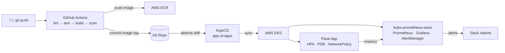

# execon-platform — GitOps DevOps Showcase

A production-grade platform demonstrating full-lifecycle DevOps: IaC, GitOps, CI/CD, and Observability — all from a single repository. One `git push` deploys the app with zero manual steps.

## Architecture



## Stack

| Layer | Technology |
|---|---|
| Cloud infra | AWS EKS, VPC, ECR, ALB |
| IaC | Terraform 1.8 + community modules |
| GitOps | ArgoCD 2.x (app-of-apps pattern) |
| CI/CD | GitHub Actions (OIDC — no static AWS credentials) |
| App | Python 3.12, Flask 3, prometheus-client, Gunicorn |
| Observability | kube-prometheus-stack (Prometheus, Grafana, AlertManager) |
| Security | Trivy in CI, NetworkPolicy, non-root container, IRSA |

## Repository Layout

```
execon-platform/
├── app/          Flask microservice + tests + Dockerfile
├── infra/        Terraform modules (vpc, eks, ecr, github-oidc) + dev environment
├── charts/       Helm charts: flask-app (7 resources) and monitoring
├── manifests/    ArgoCD Application CRDs (app-of-apps)
└── .github/      CI pipeline + Terraform plan workflow
```

## Prerequisites

- AWS CLI configured (`aws sts get-caller-identity` succeeds)
- Terraform 1.8+, kubectl, Helm 3, ArgoCD CLI, Docker

## Setup

### 1 — Bootstrap remote state (once)

```bash
cd infra/bootstrap
terraform init
terraform apply -var="state_bucket_name=execon-tfstate-$(openssl rand -hex 4)"
```

### 2 — Provision infrastructure (~15 min)

```bash
cd infra/environments/dev
# Edit backend.tf: set bucket name from step 1
# Edit terraform.tfvars: set github_org
terraform init && terraform apply
aws eks update-kubeconfig --name execon-dev --region eu-west-1
```

### 3 — Push repo to GitHub and bootstrap GitOps

```bash
git remote add origin https://github.com/YOUR_GITHUB_ORG/execon-platform.git
git push -u origin main
kubectl apply -f manifests/root-app.yaml
```

ArgoCD syncs `manifests/` and deploys the Flask app and monitoring stack automatically.

### 4 — Update manifests with your values

Edit these placeholders before pushing:
- `manifests/*.yaml` → replace `YOUR_GITHUB_ORG` and `YOUR_ECR_URL`
- `.github/workflows/ci.yaml` → replace `YOUR_ECR_REGISTRY`, `YOUR_AWS_REGION`, `YOUR_ROLE_ARN`
- `.github/workflows/terraform-plan.yaml` → replace `YOUR_ROLE_ARN`
- `charts/monitoring/values.yaml` → replace `YOUR_SLACK_WEBHOOK_URL`

## Access

```bash
# ArgoCD UI
kubectl -n argocd get svc argocd-server -o jsonpath='{.status.loadBalancer.ingress[0].hostname}'

# Flask app
kubectl -n flask-app get ingress flask-app -o jsonpath='{.status.loadBalancer.ingress[0].hostname}'

# Grafana (admin / changeme-set-via-secret)
kubectl -n monitoring get svc monitoring-grafana -o jsonpath='{.status.loadBalancer.ingress[0].hostname}'
```

## Tear Down

```bash
cd infra/environments/dev && terraform destroy
```
