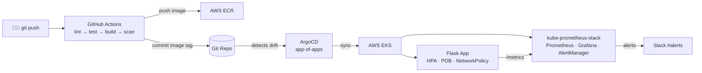

# GitOps DevOps Platform Implementation Plan

> **For agentic workers:** REQUIRED SUB-SKILL: Use superpowers:subagent-driven-development (recommended) or superpowers:executing-plans to implement this plan task-by-task. Steps use checkbox (`- [ ]`) syntax for tracking.

**Goal:** Build a production-grade, GitOps-first DevOps platform on AWS EKS such that a single `git push` to `main` builds, scans, and deploys the Flask app with zero manual steps, while Grafana dashboards and AlertManager rules are fully GitOps-managed.

**Architecture:** Terraform provisions VPC + EKS + ECR with S3 remote state. GitHub Actions builds, scans, and pushes Docker images to ECR then commits the updated image tag to Git. ArgoCD watches the repo and syncs the Flask app and monitoring stack to EKS automatically. Grafana dashboards and AlertManager rules are declared as Kubernetes resource YAML in the Helm chart — no UI clicks required.

**Tech Stack:** Python 3.12, Flask 3.x, prometheus-client, Gunicorn, Terraform 1.8, terraform-aws-modules (vpc ~5.0, eks ~20.0, iam ~5.39), Helm 3, ArgoCD 2.x (argo-cd chart 7.3.4), kube-prometheus-stack 61.2.0, GitHub Actions, AWS EKS/ECR/VPC/ALB Controller 1.8, Trivy

---

## File Map

| File | Purpose |
|---|---|
| `app/src/app.py` | Flask application factory — routes, metric hooks |
| `app/src/metrics.py` | Prometheus metric definitions (Counter, Histogram, Gauge) |
| `app/tests/conftest.py` | pytest fixture: sys.path setup + Flask test client |
| `app/tests/test_app.py` | pytest tests for all four endpoints |
| `app/requirements.txt` | Python dependencies |
| `app/Dockerfile` | Multi-stage build: builder → python:3.12-slim + non-root user |
| `app/.dockerignore` | Exclude tests and cache from Docker context |
| `infra/bootstrap/main.tf` | S3 bucket + DynamoDB table for Terraform remote state |
| `infra/bootstrap/variables.tf` | Bootstrap input variables |
| `infra/bootstrap/outputs.tf` | Bucket name + table name outputs |
| `infra/modules/vpc/main.tf` | VPC module wrapping terraform-aws-modules/vpc |
| `infra/modules/vpc/variables.tf` | VPC input variables |
| `infra/modules/vpc/outputs.tf` | vpc_id, private_subnet_ids, public_subnet_ids |
| `infra/modules/ecr/main.tf` | ECR repository + lifecycle policy + scan-on-push |
| `infra/modules/ecr/variables.tf` | ECR input variables |
| `infra/modules/ecr/outputs.tf` | repository_url, repository_arn |
| `infra/modules/github-oidc/main.tf` | GitHub Actions OIDC provider + IAM role for ECR push |
| `infra/modules/github-oidc/variables.tf` | github_org, github_repo, ecr_arns |
| `infra/modules/github-oidc/outputs.tf` | role_arn |
| `infra/modules/eks/main.tf` | EKS cluster + IRSA for ALB Controller + ArgoCD Helm release + ALB Controller Helm release |
| `infra/modules/eks/variables.tf` | EKS input variables |
| `infra/modules/eks/outputs.tf` | cluster_name, cluster_endpoint, oidc_provider_arn |
| `infra/environments/dev/backend.tf` | S3 backend configuration |
| `infra/environments/dev/main.tf` | Dev environment: calls vpc, ecr, github-oidc, eks modules |
| `infra/environments/dev/variables.tf` | Variable declarations |
| `infra/environments/dev/terraform.tfvars` | github_org, github_repo values |
| `charts/flask-app/Chart.yaml` | Helm chart metadata |
| `charts/flask-app/values.yaml` | Default values (image, replicas, resources, HPA) |
| `charts/flask-app/templates/deployment.yaml` | Deployment with probes, resources, rolling update |
| `charts/flask-app/templates/service.yaml` | ClusterIP Service |
| `charts/flask-app/templates/ingress.yaml` | Ingress with ALB annotation |
| `charts/flask-app/templates/hpa.yaml` | HorizontalPodAutoscaler (2–10 pods at 70% CPU) |
| `charts/flask-app/templates/pdb.yaml` | PodDisruptionBudget (minAvailable: 1) |
| `charts/flask-app/templates/servicemonitor.yaml` | ServiceMonitor (Prometheus scrape config) |
| `charts/flask-app/templates/networkpolicy.yaml` | NetworkPolicy (deny-all + allowlist) |
| `charts/monitoring/Chart.yaml` | Monitoring chart with kube-prometheus-stack dependency |
| `charts/monitoring/Chart.lock` | Pinned dependency versions |
| `charts/monitoring/values.yaml` | kube-prometheus-stack overrides + Slack AlertManager config |
| `charts/monitoring/templates/dashboard-flask-app.yaml` | Grafana RED metrics dashboard ConfigMap |
| `charts/monitoring/templates/dashboard-cluster.yaml` | Grafana cluster health dashboard ConfigMap |
| `charts/monitoring/templates/prometheusrule.yaml` | PrometheusRule with 3 alerting rules |
| `manifests/root-app.yaml` | ArgoCD root Application (app-of-apps) |
| `manifests/flask-app-app.yaml` | ArgoCD Application for flask-app Helm chart |
| `manifests/monitoring-app.yaml` | ArgoCD Application for monitoring Helm chart |
| `.github/workflows/ci.yaml` | CI: lint → test → build → trivy scan → push ECR → update image tag |
| `.github/workflows/terraform-plan.yaml` | terraform fmt + validate + plan posted as PR comment |
| `README.md` | Architecture diagram (Mermaid) + setup guide |

---

## Task 1: Repository Structure

**Files:**
- Delete: `app.py` (root skeleton)
- Create: `app/src/__init__.py`, `app/tests/__init__.py`
- Create: `app/tests/conftest.py`
- Create: `app/requirements.txt`
- Create: `.gitignore` (extend existing)

- [ ] **Step 1: Remove root skeleton and scaffold all directories**

```bash
rm app.py
mkdir -p app/src app/tests \
  infra/bootstrap \
  infra/modules/vpc \
  infra/modules/ecr \
  infra/modules/github-oidc \
  infra/modules/eks \
  infra/environments/dev \
  charts/flask-app/templates \
  charts/monitoring/templates \
  manifests \
  .github/workflows
touch app/src/__init__.py app/tests/__init__.py
```

- [ ] **Step 2: Write `app/tests/conftest.py`**

```python
import sys
import os
import pytest

sys.path.insert(0, os.path.join(os.path.dirname(__file__), "..", "src"))

from app import create_app


@pytest.fixture
def client():
    application = create_app()
    application.config["TESTING"] = True
    with application.test_client() as c:
        yield c
```

- [ ] **Step 3: Write `app/requirements.txt`**

```
flask==3.0.3
prometheus-client==0.20.0
gunicorn==22.0.0
pytest==8.2.0
pytest-cov==5.0.0
flake8==7.0.0
```

- [ ] **Step 4: Add Helm chart directories to `.gitignore`**

```bash
cat >> .gitignore << 'EOF'
.superpowers/
charts/*/charts/
charts/*/.helmcache/
__pycache__/
*.pyc
.pytest_cache/
infra/**/.terraform/
infra/**/*.tfplan
EOF
```

- [ ] **Step 5: Commit**

```bash
git add app/ infra/ charts/ manifests/ .github/ .gitignore
git commit -m "chore: scaffold project directory structure"
```

---

## Task 2: Flask App Tests (TDD — write tests first)

**Files:**
- Create: `app/tests/test_app.py`

- [ ] **Step 1: Write `app/tests/test_app.py`**

```python
def test_index_returns_200(client):
    response = client.get("/")
    assert response.status_code == 200


def test_index_returns_json_message(client):
    response = client.get("/")
    data = response.get_json()
    assert "message" in data


def test_health_returns_ok(client):
    response = client.get("/health")
    assert response.status_code == 200
    assert response.get_json() == {"status": "ok"}


def test_ready_returns_ready(client):
    response = client.get("/ready")
    assert response.status_code == 200
    assert response.get_json() == {"status": "ready"}


def test_metrics_returns_200(client):
    response = client.get("/metrics")
    assert response.status_code == 200


def test_metrics_contains_request_counter(client):
    client.get("/")
    response = client.get("/metrics")
    assert b"http_requests_total" in response.data


def test_metrics_contains_request_latency(client):
    client.get("/")
    response = client.get("/metrics")
    assert b"http_request_duration_seconds" in response.data


def test_metrics_content_type_is_text(client):
    response = client.get("/metrics")
    assert "text/plain" in response.content_type
```

- [ ] **Step 2: Run tests — expect failure (app module not found)**

```bash
cd app && pip install -r requirements.txt
pytest tests/test_app.py -v
```

Expected output: `ModuleNotFoundError: No module named 'app'`

- [ ] **Step 3: Commit the failing tests**

```bash
git add app/tests/test_app.py
git commit -m "test: add endpoint tests (red)"
```

---

## Task 3: Flask App Implementation

**Files:**
- Create: `app/src/metrics.py`
- Create: `app/src/app.py`

- [ ] **Step 1: Write `app/src/metrics.py`**

```python
import os
from prometheus_client import Counter, Histogram, Gauge

REQUEST_COUNT = Counter(
    "http_requests_total",
    "Total HTTP request count",
    ["method", "endpoint", "status"],
)

REQUEST_LATENCY = Histogram(
    "http_request_duration_seconds",
    "HTTP request latency in seconds",
    ["method", "endpoint"],
)

APP_INFO = Gauge(
    "app_info",
    "Application metadata",
    ["version", "environment"],
)

APP_INFO.labels(
    version=os.getenv("APP_VERSION", "dev"),
    environment=os.getenv("APP_ENV", "development"),
).set(1)
```

- [ ] **Step 2: Write `app/src/app.py`**

```python
import time
from flask import Flask, jsonify, Response, g, request
from prometheus_client import generate_latest, CONTENT_TYPE_LATEST
from metrics import REQUEST_COUNT, REQUEST_LATENCY


def create_app():
    app = Flask(__name__)

    @app.before_request
    def start_timer():
        g.start = time.time()

    @app.after_request
    def record_metrics(response):
        latency = time.time() - g.start
        REQUEST_COUNT.labels(
            method=request.method,
            endpoint=request.path,
            status=response.status_code,
        ).inc()
        REQUEST_LATENCY.labels(
            method=request.method,
            endpoint=request.path,
        ).observe(latency)
        return response

    @app.route("/")
    def index():
        return jsonify({"message": "GitOps Platform — Running"})

    @app.route("/health")
    def health():
        return jsonify({"status": "ok"})

    @app.route("/ready")
    def ready():
        return jsonify({"status": "ready"})

    @app.route("/metrics")
    def metrics():
        return Response(generate_latest(), mimetype=CONTENT_TYPE_LATEST)

    return app


if __name__ == "__main__":
    app = create_app()
    app.run(host="0.0.0.0", port=8080)
```

- [ ] **Step 3: Run tests — all must pass**

```bash
cd app && pytest tests/test_app.py -v --cov=src --cov-report=term-missing
```

Expected: 8 tests PASS, coverage ≥ 90%.

- [ ] **Step 4: Commit**

```bash
git add app/src/
git commit -m "feat: implement Flask app with Prometheus metrics"
```

---

## Task 4: Multi-Stage Dockerfile

**Files:**
- Create: `app/Dockerfile`
- Create: `app/.dockerignore`

- [ ] **Step 1: Write `app/Dockerfile`**

```dockerfile
# Stage 1: install dependencies
FROM python:3.12-slim AS builder
WORKDIR /build
COPY requirements.txt .
RUN pip install --no-cache-dir --prefix=/install -r requirements.txt

# Stage 2: minimal runtime with non-root user
FROM python:3.12-slim
RUN useradd --no-create-home --shell /bin/false appuser
WORKDIR /app
COPY --from=builder /install /usr/local
COPY src/ .
USER appuser
EXPOSE 8080
CMD ["gunicorn", "--bind", "0.0.0.0:8080", "--workers", "2", "--access-logfile", "-", "app:create_app()"]
```

- [ ] **Step 2: Write `app/.dockerignore`**

```
__pycache__/
*.pyc
*.pyo
tests/
.pytest_cache/
```

- [ ] **Step 3: Build and smoke-test locally**

```bash
cd app
docker build -t flask-app:local .
docker run --rm -d -p 8080:8080 --name flask-test flask-app:local
sleep 3
curl -sf http://localhost:8080/health
# Expected: {"status":"ok"}
curl -sf http://localhost:8080/metrics | grep http_requests_total
# Expected: a line starting with http_requests_total
docker stop flask-test
```

- [ ] **Step 4: Commit**

```bash
git add app/Dockerfile app/.dockerignore
git commit -m "feat: add multi-stage Dockerfile with non-root runtime"
```

---

## Task 5: Terraform Bootstrap (Remote State)

**Files:**
- Create: `infra/bootstrap/variables.tf`
- Create: `infra/bootstrap/main.tf`
- Create: `infra/bootstrap/outputs.tf`

- [ ] **Step 1: Write `infra/bootstrap/variables.tf`**

```hcl
variable "aws_region" {
  type    = string
  default = "eu-west-1"
}

variable "state_bucket_name" {
  type        = string
  description = "Globally unique S3 bucket name for Terraform state"
}

variable "lock_table_name" {
  type    = string
  default = "terraform-locks"
}
```

- [ ] **Step 2: Write `infra/bootstrap/main.tf`**

```hcl
terraform {
  required_providers {
    aws = { source = "hashicorp/aws", version = "~> 5.0" }
  }
}

provider "aws" { region = var.aws_region }

resource "aws_s3_bucket" "state" {
  bucket        = var.state_bucket_name
  force_destroy = false
}

resource "aws_s3_bucket_versioning" "state" {
  bucket = aws_s3_bucket.state.id
  versioning_configuration { status = "Enabled" }
}

resource "aws_s3_bucket_server_side_encryption_configuration" "state" {
  bucket = aws_s3_bucket.state.id
  rule {
    apply_server_side_encryption_by_default { sse_algorithm = "AES256" }
  }
}

resource "aws_s3_bucket_public_access_block" "state" {
  bucket                  = aws_s3_bucket.state.id
  block_public_acls       = true
  block_public_policy     = true
  ignore_public_acls      = true
  restrict_public_buckets = true
}

resource "aws_dynamodb_table" "locks" {
  name         = var.lock_table_name
  billing_mode = "PAY_PER_REQUEST"
  hash_key     = "LockID"
  attribute { name = "LockID"; type = "S" }
}
```

- [ ] **Step 3: Write `infra/bootstrap/outputs.tf`**

```hcl
output "state_bucket_name" { value = aws_s3_bucket.state.id }
output "lock_table_name"   { value = aws_dynamodb_table.locks.name }
```

- [ ] **Step 4: Apply bootstrap (run once, note the bucket name)**

```bash
cd infra/bootstrap
terraform init
BUCKET_NAME="execon-tfstate-$(openssl rand -hex 4)"
terraform apply -var="state_bucket_name=${BUCKET_NAME}" -auto-approve
echo "Bucket: ${BUCKET_NAME}"
# Copy this value — you need it for infra/environments/dev/backend.tf
```

- [ ] **Step 5: Commit**

```bash
git add infra/bootstrap/
git commit -m "feat: add Terraform bootstrap for remote state"
```

---

## Task 6: VPC Module

**Files:**
- Create: `infra/modules/vpc/variables.tf`
- Create: `infra/modules/vpc/main.tf`
- Create: `infra/modules/vpc/outputs.tf`

- [ ] **Step 1: Write `infra/modules/vpc/variables.tf`**

```hcl
variable "name"            { type = string }
variable "cidr"            { type = string }
variable "azs"             { type = list(string) }
variable "private_subnets" { type = list(string) }
variable "public_subnets"  { type = list(string) }
variable "tags"            { type = map(string); default = {} }
```

- [ ] **Step 2: Write `infra/modules/vpc/main.tf`**

```hcl
terraform {
  required_providers {
    aws = { source = "hashicorp/aws", version = "~> 5.0" }
  }
}

module "vpc" {
  source  = "terraform-aws-modules/vpc/aws"
  version = "~> 5.0"

  name = var.name
  cidr = var.cidr

  azs             = var.azs
  private_subnets = var.private_subnets
  public_subnets  = var.public_subnets

  enable_nat_gateway   = true
  single_nat_gateway   = true
  enable_dns_hostnames = true
  enable_dns_support   = true

  enable_flow_log                      = true
  flow_log_destination_type            = "s3"
  flow_log_destination_arn             = aws_s3_bucket.flow_logs.arn

  public_subnet_tags  = { "kubernetes.io/role/elb"          = "1" }
  private_subnet_tags = { "kubernetes.io/role/internal-elb" = "1" }

  tags = var.tags
}

resource "aws_s3_bucket" "flow_logs" {
  bucket        = "${var.name}-vpc-flow-logs"
  force_destroy = true
  tags          = var.tags
}

resource "aws_s3_bucket_public_access_block" "flow_logs" {
  bucket                  = aws_s3_bucket.flow_logs.id
  block_public_acls       = true
  block_public_policy     = true
  ignore_public_acls      = true
  restrict_public_buckets = true
}
```

- [ ] **Step 3: Write `infra/modules/vpc/outputs.tf`**

```hcl
output "vpc_id"             { value = module.vpc.vpc_id }
output "private_subnet_ids" { value = module.vpc.private_subnets }
output "public_subnet_ids"  { value = module.vpc.public_subnets }
```

- [ ] **Step 4: Validate**

```bash
cd infra/modules/vpc && terraform init -backend=false && terraform validate
```

Expected: `Success! The configuration is valid.`

- [ ] **Step 5: Commit**

```bash
git add infra/modules/vpc/
git commit -m "feat: add VPC Terraform module with flow logs"
```

---

## Task 7: ECR Module + GitHub OIDC IAM Role

**Files:**
- Create: `infra/modules/ecr/variables.tf`, `main.tf`, `outputs.tf`
- Create: `infra/modules/github-oidc/variables.tf`, `main.tf`, `outputs.tf`

- [ ] **Step 1: Write `infra/modules/ecr/variables.tf`**

```hcl
variable "name"        { type = string }
variable "keep_last_n" { type = number; default = 10 }
variable "tags"        { type = map(string); default = {} }
```

- [ ] **Step 2: Write `infra/modules/ecr/main.tf`**

```hcl
terraform {
  required_providers {
    aws = { source = "hashicorp/aws", version = "~> 5.0" }
  }
}

resource "aws_ecr_repository" "this" {
  name                 = var.name
  image_tag_mutability = "MUTABLE"
  force_delete         = true

  image_scanning_configuration { scan_on_push = true }

  tags = var.tags
}

resource "aws_ecr_lifecycle_policy" "this" {
  repository = aws_ecr_repository.this.name

  policy = jsonencode({
    rules = [{
      rulePriority = 1
      description  = "Keep last ${var.keep_last_n} images"
      selection    = { tagStatus = "any"; countType = "imageCountMoreThan"; countNumber = var.keep_last_n }
      action       = { type = "expire" }
    }]
  })
}
```

- [ ] **Step 3: Write `infra/modules/ecr/outputs.tf`**

```hcl
output "repository_url" { value = aws_ecr_repository.this.repository_url }
output "repository_arn" { value = aws_ecr_repository.this.arn }
```

- [ ] **Step 4: Write `infra/modules/github-oidc/variables.tf`**

```hcl
variable "github_org"  { type = string }
variable "github_repo" { type = string }
variable "ecr_arns"    { type = list(string) }
variable "tags"        { type = map(string); default = {} }
```

- [ ] **Step 5: Write `infra/modules/github-oidc/main.tf`**

```hcl
terraform {
  required_providers {
    aws = { source = "hashicorp/aws", version = "~> 5.0" }
  }
}

resource "aws_iam_openid_connect_provider" "github" {
  url             = "https://token.actions.githubusercontent.com"
  client_id_list  = ["sts.amazonaws.com"]
  thumbprint_list = ["6938fd4d98bab03faadb97b34396831e3780aea1"]
}

data "aws_iam_policy_document" "github_trust" {
  statement {
    actions = ["sts:AssumeRoleWithWebIdentity"]
    principals {
      type        = "Federated"
      identifiers = [aws_iam_openid_connect_provider.github.arn]
    }
    condition {
      test     = "StringLike"
      variable = "token.actions.githubusercontent.com:sub"
      values   = ["repo:${var.github_org}/${var.github_repo}:*"]
    }
    condition {
      test     = "StringEquals"
      variable = "token.actions.githubusercontent.com:aud"
      values   = ["sts.amazonaws.com"]
    }
  }
}

resource "aws_iam_role" "github_actions" {
  name               = "github-actions-ecr-push"
  assume_role_policy = data.aws_iam_policy_document.github_trust.json
  tags               = var.tags
}

data "aws_iam_policy_document" "ecr_push" {
  statement {
    actions = [
      "ecr:BatchCheckLayerAvailability",
      "ecr:InitiateLayerUpload",
      "ecr:UploadLayerPart",
      "ecr:CompleteLayerUpload",
      "ecr:PutImage",
    ]
    resources = var.ecr_arns
  }
  statement {
    actions   = ["ecr:GetAuthorizationToken"]
    resources = ["*"]
  }
}

resource "aws_iam_role_policy" "ecr_push" {
  role   = aws_iam_role.github_actions.name
  policy = data.aws_iam_policy_document.ecr_push.json
}
```

- [ ] **Step 6: Write `infra/modules/github-oidc/outputs.tf`**

```hcl
output "role_arn" { value = aws_iam_role.github_actions.arn }
```

- [ ] **Step 7: Validate both modules**

```bash
cd infra/modules/ecr && terraform init -backend=false && terraform validate
cd ../github-oidc && terraform init -backend=false && terraform validate
```

Expected: `Success! The configuration is valid.` for both.

- [ ] **Step 8: Commit**

```bash
git add infra/modules/ecr/ infra/modules/github-oidc/
git commit -m "feat: add ECR and GitHub OIDC Terraform modules"
```

---

## Task 8: EKS Module

**Files:**
- Create: `infra/modules/eks/variables.tf`
- Create: `infra/modules/eks/main.tf`
- Create: `infra/modules/eks/outputs.tf`

- [ ] **Step 1: Write `infra/modules/eks/variables.tf`**

```hcl
variable "cluster_name"       { type = string }
variable "vpc_id"             { type = string }
variable "private_subnet_ids" { type = list(string) }
variable "tags"               { type = map(string); default = {} }
```

- [ ] **Step 2: Write `infra/modules/eks/main.tf`**

```hcl
terraform {
  required_providers {
    aws        = { source = "hashicorp/aws",        version = "~> 5.0"  }
    helm       = { source = "hashicorp/helm",       version = "~> 2.13" }
    kubernetes = { source = "hashicorp/kubernetes", version = "~> 2.29" }
  }
}

module "eks" {
  source  = "terraform-aws-modules/eks/aws"
  version = "~> 20.0"

  cluster_name                   = var.cluster_name
  cluster_version                = "1.29"
  vpc_id                         = var.vpc_id
  subnet_ids                     = var.private_subnet_ids
  cluster_endpoint_public_access = true

  eks_managed_node_groups = {
    main = {
      instance_types = ["t3.medium"]
      min_size       = 2
      max_size       = 4
      desired_size   = 2
    }
  }

  enable_cluster_creator_admin_permissions = true
  tags                                     = var.tags
}

module "aws_lbc_irsa" {
  source  = "terraform-aws-modules/iam/aws//modules/iam-role-for-service-accounts-eks"
  version = "~> 5.39"

  role_name                              = "${var.cluster_name}-aws-lbc"
  attach_load_balancer_controller_policy = true

  oidc_providers = {
    main = {
      provider_arn               = module.eks.oidc_provider_arn
      namespace_service_accounts = ["kube-system:aws-load-balancer-controller"]
    }
  }
}

provider "helm" {
  kubernetes {
    host                   = module.eks.cluster_endpoint
    cluster_ca_certificate = base64decode(module.eks.cluster_certificate_authority_data)
    exec {
      api_version = "client.authentication.k8s.io/v1beta1"
      command     = "aws"
      args        = ["eks", "get-token", "--cluster-name", module.eks.cluster_name]
    }
  }
}

resource "helm_release" "aws_load_balancer_controller" {
  name       = "aws-load-balancer-controller"
  repository = "https://aws.github.io/eks-charts"
  chart      = "aws-load-balancer-controller"
  version    = "1.8.1"
  namespace  = "kube-system"

  set { name = "clusterName";                                                value = module.eks.cluster_name }
  set { name = "serviceAccount.name";                                        value = "aws-load-balancer-controller" }
  set { name = "serviceAccount.annotations.eks\\.amazonaws\\.com/role-arn"; value = module.aws_lbc_irsa.iam_role_arn }

  depends_on = [module.eks]
}

resource "helm_release" "argocd" {
  name             = "argocd"
  repository       = "https://argoproj.github.io/argo-helm"
  chart            = "argo-cd"
  version          = "7.3.4"
  namespace        = "argocd"
  create_namespace = true

  values = [yamlencode({
    server = {
      service   = { type = "LoadBalancer" }
      extraArgs = ["--insecure"]
    }
  })]

  depends_on = [module.eks]
}
```

- [ ] **Step 3: Write `infra/modules/eks/outputs.tf`**

```hcl
output "cluster_name"                       { value = module.eks.cluster_name }
output "cluster_endpoint"                   { value = module.eks.cluster_endpoint }
output "cluster_certificate_authority_data" { value = module.eks.cluster_certificate_authority_data }
output "oidc_provider_arn"                  { value = module.eks.oidc_provider_arn }
```

- [ ] **Step 4: Validate**

```bash
cd infra/modules/eks && terraform init -backend=false && terraform validate
```

Expected: `Success! The configuration is valid.`

- [ ] **Step 5: Commit**

```bash
git add infra/modules/eks/
git commit -m "feat: add EKS module with ArgoCD and ALB Controller"
```

---

## Task 9: Dev Environment + Apply

**Files:**
- Create: `infra/environments/dev/backend.tf`
- Create: `infra/environments/dev/variables.tf`
- Create: `infra/environments/dev/terraform.tfvars`
- Create: `infra/environments/dev/main.tf`

- [ ] **Step 1: Write `infra/environments/dev/backend.tf`**

Replace `YOUR_BUCKET_NAME` with the value from Task 5 Step 4.

```hcl
terraform {
  backend "s3" {
    bucket         = "YOUR_BUCKET_NAME"
    key            = "dev/terraform.tfstate"
    region         = "eu-west-1"
    dynamodb_table = "terraform-locks"
    encrypt        = true
  }
}
```

- [ ] **Step 2: Write `infra/environments/dev/variables.tf`**

```hcl
variable "aws_region"  { type = string; default = "eu-west-1" }
variable "github_org"  { type = string }
variable "github_repo" { type = string }
```

- [ ] **Step 3: Write `infra/environments/dev/terraform.tfvars`**

Replace values with your GitHub username and the repository name you'll push to.

```hcl
github_org  = "YOUR_GITHUB_USERNAME"
github_repo = "execon-platform"
```

- [ ] **Step 4: Write `infra/environments/dev/main.tf`**

```hcl
terraform {
  required_providers {
    aws  = { source = "hashicorp/aws",  version = "~> 5.0"  }
    helm = { source = "hashicorp/helm", version = "~> 2.13" }
  }
}

provider "aws" { region = var.aws_region }

locals {
  name = "execon-dev"
  tags = { Environment = "dev", Project = "execon-platform" }
  azs  = ["${var.aws_region}a", "${var.aws_region}b", "${var.aws_region}c"]
}

module "vpc" {
  source = "../../modules/vpc"

  name            = local.name
  cidr            = "10.0.0.0/16"
  azs             = local.azs
  private_subnets = ["10.0.0.0/24", "10.0.1.0/24", "10.0.2.0/24"]
  public_subnets  = ["10.0.100.0/24", "10.0.101.0/24", "10.0.102.0/24"]
  tags            = local.tags
}

module "ecr" {
  source = "../../modules/ecr"
  name   = "flask-app"
  tags   = local.tags
}

module "github_oidc" {
  source      = "../../modules/github-oidc"
  github_org  = var.github_org
  github_repo = var.github_repo
  ecr_arns    = [module.ecr.repository_arn]
  tags        = local.tags
}

module "eks" {
  source             = "../../modules/eks"
  cluster_name       = local.name
  vpc_id             = module.vpc.vpc_id
  private_subnet_ids = module.vpc.private_subnet_ids
  tags               = local.tags
}

output "ecr_repository_url"      { value = module.ecr.repository_url }
output "github_actions_role_arn" { value = module.github_oidc.role_arn }
output "cluster_name"            { value = module.eks.cluster_name }
output "argocd_password_cmd" {
  value = "kubectl -n argocd get secret argocd-initial-admin-secret -o jsonpath='{.data.password}' | base64 -d"
}
```

- [ ] **Step 5: Plan, then apply (takes ~15 min)**

```bash
cd infra/environments/dev
terraform init
terraform plan
terraform apply -auto-approve
```

Expected: all resources created. Copy `ecr_repository_url` and `github_actions_role_arn` from the output — needed in Tasks 11 and 12.

- [ ] **Step 6: Configure kubectl and verify**

```bash
aws eks update-kubeconfig --name execon-dev --region eu-west-1
kubectl get nodes
# Expected: 2 nodes in Ready state
kubectl -n argocd get pods
# Expected: all argocd-* pods Running
```

- [ ] **Step 7: Commit**

```bash
git add infra/environments/dev/
git commit -m "feat: add dev environment Terraform configuration"
```

---

## Task 10: flask-app Helm Chart

**Files:**
- Create: `charts/flask-app/Chart.yaml`
- Create: `charts/flask-app/values.yaml`
- Create: `charts/flask-app/templates/deployment.yaml`
- Create: `charts/flask-app/templates/service.yaml`
- Create: `charts/flask-app/templates/ingress.yaml`
- Create: `charts/flask-app/templates/hpa.yaml`
- Create: `charts/flask-app/templates/pdb.yaml`
- Create: `charts/flask-app/templates/servicemonitor.yaml`
- Create: `charts/flask-app/templates/networkpolicy.yaml`

- [ ] **Step 1: Write `charts/flask-app/Chart.yaml`**

```yaml
apiVersion: v2
name: flask-app
description: GitOps interview showcase Flask microservice
type: application
version: 0.1.0
appVersion: "1.0"
```

- [ ] **Step 2: Write `charts/flask-app/values.yaml`**

```yaml
image:
  repository: ""   # set to <account>.dkr.ecr.<region>.amazonaws.com/flask-app
  tag: "latest"
  pullPolicy: IfNotPresent

replicaCount: 2

service:
  port: 8080

resources:
  requests:
    cpu: 100m
    memory: 128Mi
  limits:
    cpu: 500m
    memory: 256Mi

hpa:
  minReplicas: 2
  maxReplicas: 10
  targetCPUUtilizationPercentage: 70

ingress:
  enabled: true
  annotations:
    kubernetes.io/ingress.class: alb
    alb.ingress.kubernetes.io/scheme: internet-facing
    alb.ingress.kubernetes.io/target-type: ip

serviceMonitor:
  enabled: true
  interval: "15s"
  path: /metrics
```

- [ ] **Step 3: Write `charts/flask-app/templates/deployment.yaml`**

```yaml
apiVersion: apps/v1
kind: Deployment
metadata:
  name: {{ .Release.Name }}
  labels:
    app: {{ .Release.Name }}
spec:
  replicas: {{ .Values.replicaCount }}
  selector:
    matchLabels:
      app: {{ .Release.Name }}
  strategy:
    type: RollingUpdate
    rollingUpdate:
      maxUnavailable: 0
      maxSurge: 1
  template:
    metadata:
      labels:
        app: {{ .Release.Name }}
    spec:
      securityContext:
        runAsNonRoot: true
        runAsUser: 1000
      containers:
        - name: {{ .Release.Name }}
          image: "{{ .Values.image.repository }}:{{ .Values.image.tag }}"
          imagePullPolicy: {{ .Values.image.pullPolicy }}
          ports:
            - containerPort: {{ .Values.service.port }}
          env:
            - name: APP_VERSION
              value: "{{ .Values.image.tag }}"
            - name: APP_ENV
              value: "production"
          resources: {{ toYaml .Values.resources | nindent 12 }}
          livenessProbe:
            httpGet:
              path: /health
              port: {{ .Values.service.port }}
            initialDelaySeconds: 10
            periodSeconds: 15
          readinessProbe:
            httpGet:
              path: /ready
              port: {{ .Values.service.port }}
            initialDelaySeconds: 5
            periodSeconds: 10
```

- [ ] **Step 4: Write `charts/flask-app/templates/service.yaml`**

```yaml
apiVersion: v1
kind: Service
metadata:
  name: {{ .Release.Name }}
  labels:
    app: {{ .Release.Name }}
spec:
  type: ClusterIP
  selector:
    app: {{ .Release.Name }}
  ports:
    - port: {{ .Values.service.port }}
      targetPort: {{ .Values.service.port }}
      name: http
```

- [ ] **Step 5: Write `charts/flask-app/templates/ingress.yaml`**

```yaml
{{- if .Values.ingress.enabled }}
apiVersion: networking.k8s.io/v1
kind: Ingress
metadata:
  name: {{ .Release.Name }}
  annotations: {{ toYaml .Values.ingress.annotations | nindent 4 }}
spec:
  rules:
    - http:
        paths:
          - path: /
            pathType: Prefix
            backend:
              service:
                name: {{ .Release.Name }}
                port:
                  number: {{ .Values.service.port }}
{{- end }}
```

- [ ] **Step 6: Write `charts/flask-app/templates/hpa.yaml`**

```yaml
apiVersion: autoscaling/v2
kind: HorizontalPodAutoscaler
metadata:
  name: {{ .Release.Name }}
spec:
  scaleTargetRef:
    apiVersion: apps/v1
    kind: Deployment
    name: {{ .Release.Name }}
  minReplicas: {{ .Values.hpa.minReplicas }}
  maxReplicas: {{ .Values.hpa.maxReplicas }}
  metrics:
    - type: Resource
      resource:
        name: cpu
        target:
          type: Utilization
          averageUtilization: {{ .Values.hpa.targetCPUUtilizationPercentage }}
```

- [ ] **Step 7: Write `charts/flask-app/templates/pdb.yaml`**

```yaml
apiVersion: policy/v1
kind: PodDisruptionBudget
metadata:
  name: {{ .Release.Name }}
spec:
  minAvailable: 1
  selector:
    matchLabels:
      app: {{ .Release.Name }}
```

- [ ] **Step 8: Write `charts/flask-app/templates/servicemonitor.yaml`**

```yaml
{{- if .Values.serviceMonitor.enabled }}
apiVersion: monitoring.coreos.com/v1
kind: ServiceMonitor
metadata:
  name: {{ .Release.Name }}
  labels:
    app: {{ .Release.Name }}
spec:
  selector:
    matchLabels:
      app: {{ .Release.Name }}
  endpoints:
    - port: http
      path: {{ .Values.serviceMonitor.path }}
      interval: {{ .Values.serviceMonitor.interval }}
{{- end }}
```

- [ ] **Step 9: Write `charts/flask-app/templates/networkpolicy.yaml`**

```yaml
apiVersion: networking.k8s.io/v1
kind: NetworkPolicy
metadata:
  name: {{ .Release.Name }}
spec:
  podSelector:
    matchLabels:
      app: {{ .Release.Name }}
  policyTypes:
    - Ingress
    - Egress
  ingress:
    - ports:
        - port: {{ .Values.service.port }}
  egress:
    - to:
        - namespaceSelector:
            matchLabels:
              kubernetes.io/metadata.name: monitoring
      ports:
        - port: 9090
    - ports:
        - port: 53
          protocol: UDP
        - port: 443
```

- [ ] **Step 10: Lint the chart**

```bash
helm lint charts/flask-app
```

Expected: `1 chart(s) linted, 0 chart(s) failed`

- [ ] **Step 11: Template-render to verify output**

```bash
helm template flask-app charts/flask-app \
  --set image.repository=123456789.dkr.ecr.eu-west-1.amazonaws.com/flask-app \
  --set image.tag=git-abc1234
```

Expected: valid YAML output for all 7 resources.

- [ ] **Step 12: Commit**

```bash
git add charts/flask-app/
git commit -m "feat: add flask-app Helm chart with all 7 resources"
```

---

## Task 11: ArgoCD App-of-Apps Manifests

**Files:**
- Create: `manifests/root-app.yaml`
- Create: `manifests/flask-app-app.yaml`
- Create: `manifests/monitoring-app.yaml`

Replace `YOUR_GITHUB_ORG` and `YOUR_ECR_URL` throughout (ECR URL from Task 9 Step 5 output).

- [ ] **Step 1: Write `manifests/root-app.yaml`**

```yaml
apiVersion: argoproj.io/v1alpha1
kind: Application
metadata:
  name: root-app
  namespace: argocd
  finalizers:
    - resources-finalizer.argocd.io
spec:
  project: default
  source:
    repoURL: https://github.com/YOUR_GITHUB_ORG/execon-platform.git
    targetRevision: HEAD
    path: manifests
  destination:
    server: https://kubernetes.default.svc
    namespace: argocd
  syncPolicy:
    automated:
      selfHeal: true
      prune: true
```

- [ ] **Step 2: Write `manifests/flask-app-app.yaml`**

```yaml
apiVersion: argoproj.io/v1alpha1
kind: Application
metadata:
  name: flask-app
  namespace: argocd
  finalizers:
    - resources-finalizer.argocd.io
spec:
  project: default
  source:
    repoURL: https://github.com/YOUR_GITHUB_ORG/execon-platform.git
    targetRevision: HEAD
    path: charts/flask-app
    helm:
      parameters:
        - name: image.repository
          value: "YOUR_ECR_URL/flask-app"
  destination:
    server: https://kubernetes.default.svc
    namespace: flask-app
  syncPolicy:
    automated:
      selfHeal: true
      prune: true
    syncOptions:
      - CreateNamespace=true
```

- [ ] **Step 3: Write `manifests/monitoring-app.yaml`**

```yaml
apiVersion: argoproj.io/v1alpha1
kind: Application
metadata:
  name: monitoring
  namespace: argocd
  finalizers:
    - resources-finalizer.argocd.io
spec:
  project: default
  source:
    repoURL: https://github.com/YOUR_GITHUB_ORG/execon-platform.git
    targetRevision: HEAD
    path: charts/monitoring
  destination:
    server: https://kubernetes.default.svc
    namespace: monitoring
  syncPolicy:
    automated:
      selfHeal: true
      prune: true
    syncOptions:
      - CreateNamespace=true
      - ServerSideApply=true
```

- [ ] **Step 4: Push repo to GitHub, then apply the root app**

```bash
git remote add origin https://github.com/YOUR_GITHUB_ORG/execon-platform.git
git push -u origin main

ARGOCD_PASSWORD=$(kubectl -n argocd get secret argocd-initial-admin-secret \
  -o jsonpath='{.data.password}' | base64 -d)
ARGOCD_SERVER=$(kubectl -n argocd get svc argocd-server \
  -o jsonpath='{.status.loadBalancer.ingress[0].hostname}')

argocd login "$ARGOCD_SERVER" --username admin --password "$ARGOCD_PASSWORD" --insecure
kubectl apply -f manifests/root-app.yaml

# Watch until all apps appear
argocd app list
```

Expected: `root-app`, `flask-app`, and `monitoring` Applications visible in ArgoCD, syncing.

- [ ] **Step 5: Commit**

```bash
git add manifests/
git commit -m "feat: add ArgoCD app-of-apps manifests"
git push
```

---

## Task 12: GitHub Actions CI Pipeline

**Files:**
- Create: `.github/workflows/ci.yaml`

Replace `YOUR_ECR_REGISTRY`, `YOUR_AWS_REGION`, and `YOUR_ROLE_ARN` with values from Task 9 Step 5.

- [ ] **Step 1: Write `.github/workflows/ci.yaml`**

```yaml
name: CI

on:
  push:
    branches: [main]
    paths: ["app/**", "charts/flask-app/**"]

permissions:
  id-token: write
  contents: write

env:
  ECR_REGISTRY: YOUR_ECR_REGISTRY
  ECR_REPOSITORY: flask-app
  AWS_REGION: YOUR_AWS_REGION

jobs:
  ci:
    runs-on: ubuntu-latest

    steps:
      - uses: actions/checkout@v4

      - name: Set up Python 3.12
        uses: actions/setup-python@v5
        with:
          python-version: "3.12"

      - name: Install dependencies
        run: pip install -r app/requirements.txt

      - name: Lint
        run: flake8 app/src app/tests --max-line-length=100

      - name: Test with coverage
        run: |
          cd app
          pytest tests/ -v --cov=src --cov-fail-under=80

      - name: Configure AWS credentials (OIDC — no static keys)
        uses: aws-actions/configure-aws-credentials@v4
        with:
          role-to-assume: YOUR_ROLE_ARN
          aws-region: ${{ env.AWS_REGION }}

      - name: Login to ECR
        uses: aws-actions/amazon-ecr-login@v2

      - name: Build Docker image
        run: |
          docker build \
            --tag $ECR_REGISTRY/$ECR_REPOSITORY:git-${{ github.sha }} \
            --tag $ECR_REGISTRY/$ECR_REPOSITORY:latest \
            app/

      - name: Scan image with Trivy (fail on CRITICAL)
        uses: aquasecurity/trivy-action@master
        with:
          image-ref: "${{ env.ECR_REGISTRY }}/${{ env.ECR_REPOSITORY }}:git-${{ github.sha }}"
          exit-code: "1"
          severity: "CRITICAL"
          ignore-unfixed: true

      - name: Push to ECR
        run: |
          docker push $ECR_REGISTRY/$ECR_REPOSITORY:git-${{ github.sha }}
          docker push $ECR_REGISTRY/$ECR_REPOSITORY:latest

      - name: Update image tag in Helm values
        run: |
          sed -i "s|  tag: .*|  tag: \"git-${{ github.sha }}\"|" charts/flask-app/values.yaml
          git config user.email "ci@github-actions"
          git config user.name "GitHub Actions"
          git add charts/flask-app/values.yaml
          git diff --staged --quiet || git commit -m "ci: update flask-app image to git-${{ github.sha }}"
          git push
```

- [ ] **Step 2: Commit and push — watch the pipeline run**

```bash
git add .github/workflows/ci.yaml
git commit -m "feat: add GitHub Actions CI pipeline with OIDC auth"
git push origin main
```

Open GitHub → Actions tab. Expected: all 9 steps pass, ECR receives the image, `charts/flask-app/values.yaml` gets a new commit, ArgoCD detects the change and syncs.

---

## Task 13: Terraform Plan Workflow

**Files:**
- Create: `.github/workflows/terraform-plan.yaml`

- [ ] **Step 1: Write `.github/workflows/terraform-plan.yaml`**

Replace `YOUR_ROLE_ARN` with the same role ARN from Task 12.

```yaml
name: Terraform Plan

on:
  pull_request:
    paths: ["infra/**"]

permissions:
  id-token: write
  contents: read
  pull-requests: write

jobs:
  plan:
    runs-on: ubuntu-latest
    defaults:
      run:
        working-directory: infra/environments/dev

    steps:
      - uses: actions/checkout@v4

      - uses: hashicorp/setup-terraform@v3
        with:
          terraform_version: "1.8.0"

      - name: Configure AWS credentials (OIDC)
        uses: aws-actions/configure-aws-credentials@v4
        with:
          role-to-assume: YOUR_ROLE_ARN
          aws-region: eu-west-1

      - name: Terraform Format Check
        run: terraform fmt -check -recursive ../../

      - name: Terraform Init
        run: terraform init

      - name: Terraform Validate
        run: terraform validate

      - name: Terraform Plan
        run: terraform plan -no-color 2>&1 | tee plan-output.txt

      - name: Post plan as PR comment
        uses: actions/github-script@v7
        if: always()
        with:
          script: |
            const fs = require('fs');
            const raw = fs.readFileSync('infra/environments/dev/plan-output.txt', 'utf8');
            const body = raw.length > 60000 ? raw.slice(0, 60000) + '\n...(truncated)' : raw;
            github.rest.issues.createComment({
              issue_number: context.issue.number,
              owner: context.repo.owner,
              repo: context.repo.repo,
              body: `## Terraform Plan\n\`\`\`hcl\n${body}\n\`\`\``
            });
```

- [ ] **Step 2: Commit**

```bash
git add .github/workflows/terraform-plan.yaml
git commit -m "feat: add Terraform plan workflow for infra PRs"
git push origin main
```

---

## Task 14: Monitoring Helm Chart

**Files:**
- Create: `charts/monitoring/Chart.yaml`
- Create: `charts/monitoring/values.yaml`

- [ ] **Step 1: Write `charts/monitoring/Chart.yaml`**

```yaml
apiVersion: v2
name: monitoring
description: kube-prometheus-stack with GitOps-managed dashboards and alert rules
type: application
version: 0.1.0
dependencies:
  - name: kube-prometheus-stack
    version: "61.2.0"
    repository: https://prometheus-community.github.io/helm-charts
```

- [ ] **Step 2: Write `charts/monitoring/values.yaml`**

Replace `YOUR_SLACK_WEBHOOK_URL` with a real Slack incoming webhook URL.

```yaml
kube-prometheus-stack:
  prometheus:
    prometheusSpec:
      retention: 7d
      scrapeInterval: 15s
      serviceMonitorSelectorNilUsesHelmValues: false
      serviceMonitorSelector: {}
      serviceMonitorNamespaceSelector: {}
      ruleSelector: {}
      ruleNamespaceSelector: {}

  grafana:
    enabled: true
    adminPassword: "changeme-set-via-secret"
    sidecar:
      dashboards:
        enabled: true
        searchNamespace: ALL
        label: grafana_dashboard
        labelValue: "1"

  alertmanager:
    config:
      global:
        resolve_timeout: 5m
      route:
        receiver: slack
        group_wait: 30s
        group_interval: 5m
        repeat_interval: 12h
      receivers:
        - name: slack
          slack_configs:
            - api_url: "YOUR_SLACK_WEBHOOK_URL"
              channel: "#alerts"
              title: "{{ .GroupLabels.alertname }}"
              text: "{{ range .Alerts }}{{ .Annotations.summary }}{{ end }}"
```

- [ ] **Step 3: Fetch Helm dependencies**

```bash
helm dependency update charts/monitoring
```

Expected: `charts/monitoring/Chart.lock` created, kube-prometheus-stack chart fetched.

- [ ] **Step 4: Lint**

```bash
helm lint charts/monitoring
```

Expected: `1 chart(s) linted, 0 chart(s) failed`

- [ ] **Step 5: Commit**

```bash
git add charts/monitoring/Chart.yaml charts/monitoring/values.yaml charts/monitoring/Chart.lock
git commit -m "feat: add monitoring Helm chart wrapping kube-prometheus-stack"
git push origin main
```

---

## Task 15: Grafana Dashboards as ConfigMaps

**Files:**
- Create: `charts/monitoring/templates/dashboard-flask-app.yaml`
- Create: `charts/monitoring/templates/dashboard-cluster.yaml`

- [ ] **Step 1: Write `charts/monitoring/templates/dashboard-flask-app.yaml`**

```yaml
apiVersion: v1
kind: ConfigMap
metadata:
  name: dashboard-flask-app
  namespace: monitoring
  labels:
    grafana_dashboard: "1"
data:
  flask-app-dashboard.json: |
    {
      "title": "Flask App — RED Metrics",
      "uid": "flask-red",
      "refresh": "30s",
      "schemaVersion": 39,
      "panels": [
        {
          "id": 1, "type": "timeseries", "title": "Request Rate (req/s)",
          "gridPos": {"x": 0, "y": 0, "w": 12, "h": 8},
          "targets": [{
            "expr": "rate(http_requests_total[5m])",
            "legendFormat": "{{method}} {{endpoint}} {{status}}"
          }]
        },
        {
          "id": 2, "type": "stat", "title": "Error Rate (%)",
          "gridPos": {"x": 12, "y": 0, "w": 12, "h": 8},
          "targets": [{
            "expr": "100 * rate(http_requests_total{status=~\"5..\"}[5m]) / rate(http_requests_total[5m])",
            "legendFormat": "Error %"
          }]
        },
        {
          "id": 3, "type": "timeseries", "title": "Latency Percentiles",
          "gridPos": {"x": 0, "y": 8, "w": 12, "h": 8},
          "targets": [
            {"expr": "histogram_quantile(0.50, rate(http_request_duration_seconds_bucket[5m]))", "legendFormat": "p50"},
            {"expr": "histogram_quantile(0.95, rate(http_request_duration_seconds_bucket[5m]))", "legendFormat": "p95"},
            {"expr": "histogram_quantile(0.99, rate(http_request_duration_seconds_bucket[5m]))", "legendFormat": "p99"}
          ]
        },
        {
          "id": 4, "type": "stat", "title": "Running Pods vs HPA Max",
          "gridPos": {"x": 12, "y": 8, "w": 12, "h": 8},
          "targets": [
            {"expr": "kube_deployment_status_replicas_available{deployment=\"flask-app\"}", "legendFormat": "Running"},
            {"expr": "kube_horizontalpodautoscaler_spec_max_replicas{horizontalpodautoscaler=\"flask-app\"}", "legendFormat": "HPA Max"}
          ]
        }
      ]
    }
```

- [ ] **Step 2: Write `charts/monitoring/templates/dashboard-cluster.yaml`**

```yaml
apiVersion: v1
kind: ConfigMap
metadata:
  name: dashboard-cluster-health
  namespace: monitoring
  labels:
    grafana_dashboard: "1"
data:
  cluster-health-dashboard.json: |
    {
      "title": "Kubernetes Cluster Health",
      "uid": "k8s-health",
      "refresh": "30s",
      "schemaVersion": 39,
      "panels": [
        {
          "id": 1, "type": "timeseries", "title": "Node CPU Usage %",
          "gridPos": {"x": 0, "y": 0, "w": 12, "h": 8},
          "targets": [{
            "expr": "100 - (avg by(node) (rate(node_cpu_seconds_total{mode=\"idle\"}[5m])) * 100)",
            "legendFormat": "{{node}}"
          }]
        },
        {
          "id": 2, "type": "timeseries", "title": "Node Memory Usage %",
          "gridPos": {"x": 12, "y": 0, "w": 12, "h": 8},
          "targets": [{
            "expr": "100 * (1 - node_memory_MemAvailable_bytes / node_memory_MemTotal_bytes)",
            "legendFormat": "{{instance}}"
          }]
        },
        {
          "id": 3, "type": "stat", "title": "Pod Status",
          "gridPos": {"x": 0, "y": 8, "w": 12, "h": 8},
          "targets": [
            {"expr": "count(kube_pod_status_phase{phase=\"Running\"})", "legendFormat": "Running"},
            {"expr": "count(kube_pod_status_phase{phase=\"Pending\"}) or vector(0)", "legendFormat": "Pending"},
            {"expr": "count(kube_pod_status_phase{phase=\"Failed\"}) or vector(0)", "legendFormat": "Failed"}
          ]
        },
        {
          "id": 4, "type": "table", "title": "ArgoCD App Sync Status",
          "gridPos": {"x": 12, "y": 8, "w": 12, "h": 8},
          "targets": [{
            "expr": "argocd_app_info",
            "legendFormat": "{{name}} — {{sync_status}}"
          }]
        }
      ]
    }
```

- [ ] **Step 3: Lint**

```bash
helm lint charts/monitoring
```

Expected: `1 chart(s) linted, 0 chart(s) failed`

- [ ] **Step 4: Commit and push**

```bash
git add charts/monitoring/templates/dashboard-flask-app.yaml charts/monitoring/templates/dashboard-cluster.yaml
git commit -m "feat: add Grafana dashboards as GitOps-managed ConfigMaps"
git push origin main
```

---

## Task 16: AlertManager PrometheusRule

**Files:**
- Create: `charts/monitoring/templates/prometheusrule.yaml`

- [ ] **Step 1: Write `charts/monitoring/templates/prometheusrule.yaml`**

```yaml
apiVersion: monitoring.coreos.com/v1
kind: PrometheusRule
metadata:
  name: flask-app-alerts
  namespace: monitoring
spec:
  groups:
    - name: flask-app.rules
      interval: 30s
      rules:
        - alert: HighErrorRate
          expr: |
            (
              rate(http_requests_total{status=~"5.."}[2m]) /
              rate(http_requests_total[2m])
            ) > 0.05
          for: 2m
          labels:
            severity: critical
          annotations:
            summary: "Flask app error rate above 5%"
            description: "Error rate is {{ $value | humanizePercentage }} over the last 2 minutes."

        - alert: HighLatencyP99
          expr: |
            histogram_quantile(0.99,
              rate(http_request_duration_seconds_bucket[5m])
            ) > 0.5
          for: 5m
          labels:
            severity: warning
          annotations:
            summary: "Flask app p99 latency above 500ms"
            description: "p99 latency is {{ $value | humanizeDuration }}."

        - alert: FrequentPodRestarts
          expr: |
            increase(kube_pod_container_status_restarts_total{
              namespace="flask-app"
            }[10m]) > 3
          for: 0m
          labels:
            severity: warning
          annotations:
            summary: "Pod {{ $labels.pod }} restarting frequently"
            description: "{{ $value }} restarts in the last 10 minutes."
```

- [ ] **Step 2: Template-render and verify**

```bash
helm template monitoring charts/monitoring | grep -A 40 "kind: PrometheusRule"
```

Expected: valid PrometheusRule YAML with all 3 alert rules.

- [ ] **Step 3: Commit and push — ArgoCD syncs the full monitoring stack**

```bash
git add charts/monitoring/templates/prometheusrule.yaml
git commit -m "feat: add PrometheusRule with 3 alerting rules"
git push origin main
```

Expected: ArgoCD syncs monitoring Application → kube-prometheus-stack deploys → Grafana shows dashboards → AlertManager receives rule.

- [ ] **Step 4: Verify observability stack is live**

```bash
GRAFANA_HOST=$(kubectl -n monitoring get svc monitoring-grafana \
  -o jsonpath='{.status.loadBalancer.ingress[0].hostname}')
echo "Grafana: http://${GRAFANA_HOST}"
# Login: admin / changeme-set-via-secret
# Check: Dashboards → Flask App RED Metrics and Kubernetes Cluster Health exist
# Check: Alerting → Alert rules → HighErrorRate, HighLatencyP99, FrequentPodRestarts exist
```

---

## Task 17: README with Architecture Diagram

**Files:**
- Create: `README.md`

- [ ] **Step 1: Write `README.md`**

````markdown
# execon-platform — GitOps DevOps Showcase

A production-grade platform demonstrating full-lifecycle DevOps engineering: IaC, GitOps, CI/CD, and Observability — all from a single repository. One `git push` deploys the app with zero manual steps.

## Architecture



## Stack

| Layer | Technology |
|---|---|
| Cloud infra | AWS EKS, VPC, ECR, ALB |
| IaC | Terraform 1.8 + community modules |
| GitOps | ArgoCD 2.x (app-of-apps pattern) |
| CI/CD | GitHub Actions (OIDC — no static AWS credentials) |
| App | Python 3.12, Flask 3, prometheus-client, Gunicorn |
| Observability | kube-prometheus-stack (Prometheus, Grafana, AlertManager) |
| Security | Trivy in CI, NetworkPolicy, non-root container, IRSA |

## Repository Layout

```
execon-platform/
├── app/          Flask microservice + tests + Dockerfile
├── infra/        Terraform modules (vpc, eks, ecr, github-oidc) + dev environment
├── charts/       Helm charts: flask-app (7 resources) and monitoring
├── manifests/    ArgoCD Application CRDs (app-of-apps)
└── .github/      CI pipeline + Terraform plan workflow
```

## Prerequisites

- AWS CLI configured (`aws sts get-caller-identity` succeeds)
- Terraform 1.8+, kubectl, Helm 3, ArgoCD CLI, Docker

## Setup (3 steps)

### 1 — Bootstrap remote state (once)

```bash
cd infra/bootstrap
terraform init
terraform apply -var="state_bucket_name=execon-tfstate-$(openssl rand -hex 4)"
```

### 2 — Provision infrastructure (~15 min)

```bash
cd infra/environments/dev
# Edit backend.tf: set bucket name from step 1
# Edit terraform.tfvars: set github_org and github_repo
terraform init && terraform apply
aws eks update-kubeconfig --name execon-dev --region eu-west-1
```

### 3 — Bootstrap GitOps

```bash
kubectl apply -f manifests/root-app.yaml
```

ArgoCD syncs `manifests/`, deploying the Flask app and monitoring stack automatically.

## Access

```bash
# ArgoCD UI
kubectl -n argocd get svc argocd-server -o jsonpath='{.status.loadBalancer.ingress[0].hostname}'

# Flask app
kubectl -n flask-app get ingress flask-app -o jsonpath='{.status.loadBalancer.ingress[0].hostname}'

# Grafana (admin / changeme-set-via-secret)
kubectl -n monitoring get svc monitoring-grafana -o jsonpath='{.status.loadBalancer.ingress[0].hostname}'
```

## Tear Down

```bash
cd infra/environments/dev && terraform destroy
```
````

- [ ] **Step 2: Commit and push**

```bash
git add README.md
git commit -m "docs: add README with Mermaid architecture diagram and setup guide"
git push origin main
```

- [ ] **Step 3: Final end-to-end verification**

```bash
# 1. Make a trivial change to trigger the pipeline
echo "# trigger" >> app/src/app.py
git add app/src/app.py && git commit -m "chore: trigger CI" && git push

# 2. Watch GitHub Actions — all 9 stages should pass
# 3. Watch ArgoCD sync the new image tag
argocd app get flask-app
# Expected: Sync Status: Synced, Health Status: Healthy

# 4. Verify the app is live
APP_HOST=$(kubectl -n flask-app get ingress flask-app -o jsonpath='{.status.loadBalancer.ingress[0].hostname}')
curl -sf "http://${APP_HOST}/health"
# Expected: {"status":"ok"}

# 5. Revert the trivial change
git revert HEAD --no-edit && git push
```
